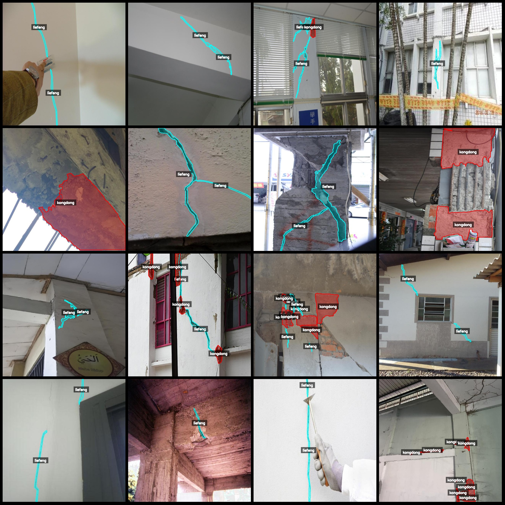
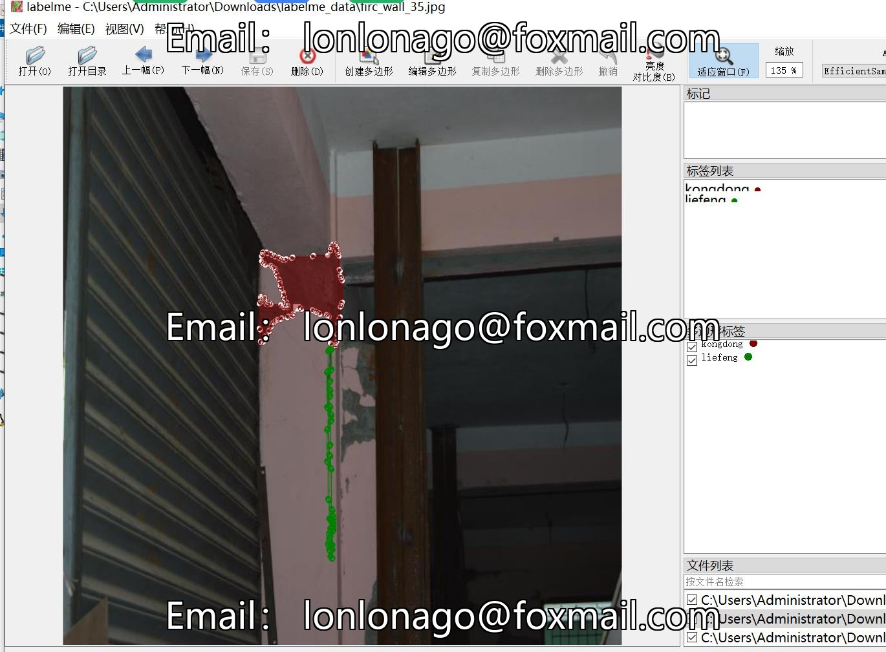

# Smart Building Wall Surface Cracks and Holes Identification and Segmentation Dataset - LabelMe Format with 2388 Images in 2 Categories

Dataset format: LabelMe format (excluding mask files, containing only jpg images and corresponding json files)
Number of images (number of jpg files): 2388
Number of annotations (json file count): 2388
Number of annotation categories: 2
Annotation category names: ["kongdong", "liefeng"]
Number of bounding boxes per category:
kongdong count = 2152
liefeng count = 6336
Total bounding boxes: 8488
Annotation tool used: labelme version 5.5.0
Image resolution: 640x640
Annotation rules: Polygons are drawn around the categories
Important note: The dataset can be opened and edited using LabelMe; for JSON datasets, they need to be converted into either a Mask or YOLOF/COCO format for semantic segmentation or instance 
segmentation.
Special declaration: This dataset does not guarantee the accuracy of the trained models or weight files.
Preview of images in labeled format:
Example of annotation drawing result:
Labelme editing image example:

## Images

Here is a pay link on Stripe ( https://buy.stripe.com/3cs8yP7sY87d0vu9AB ). Please contact me lonlonago@foxmail.com after funding $89, and I will send you a complete data files , thank you!

